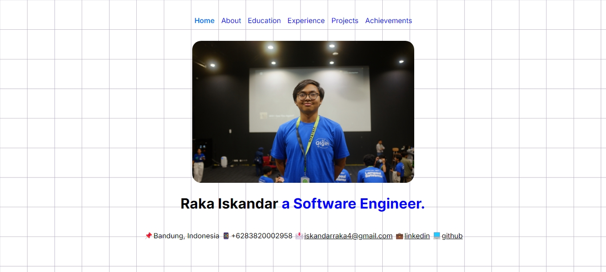
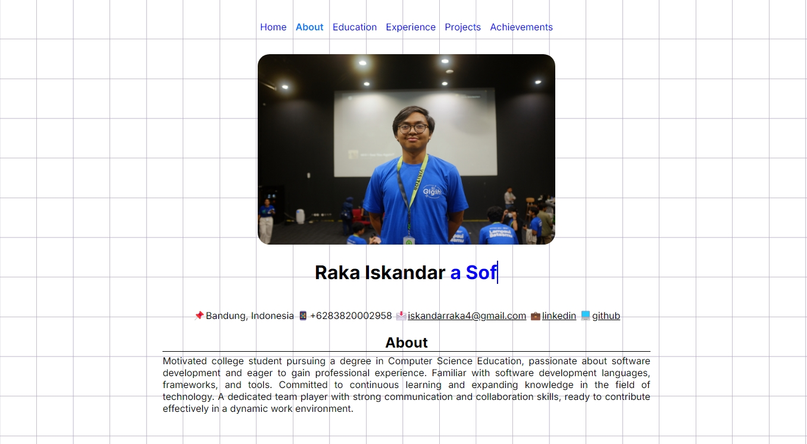
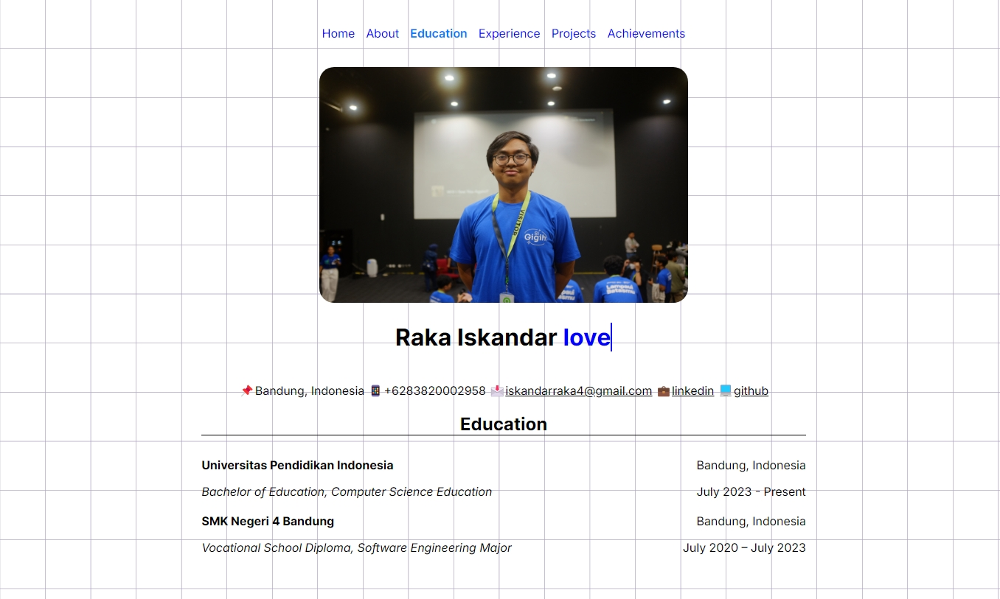
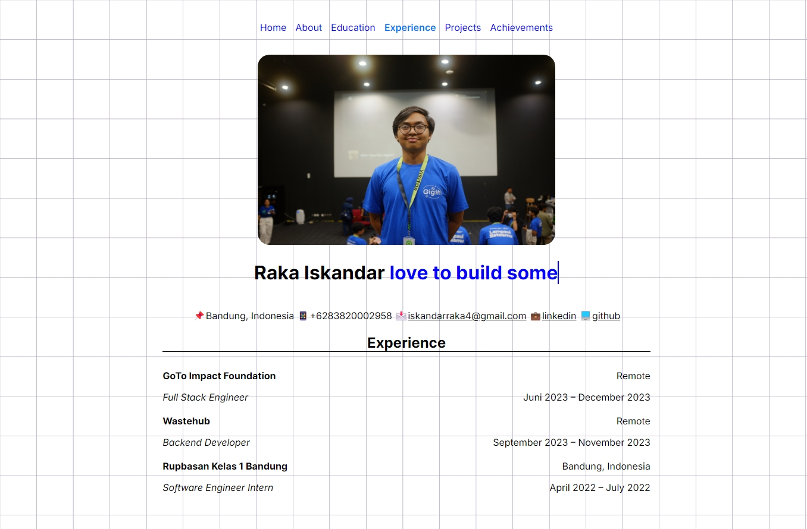
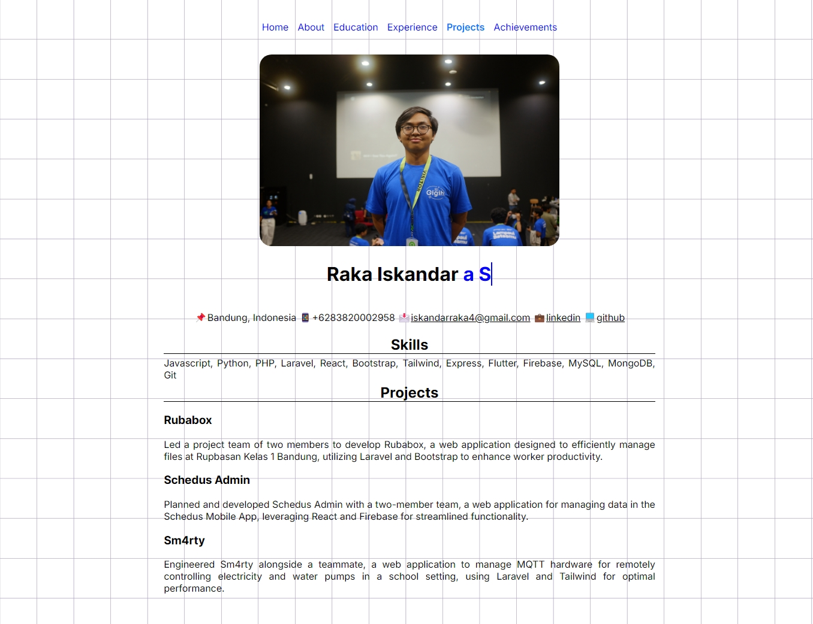
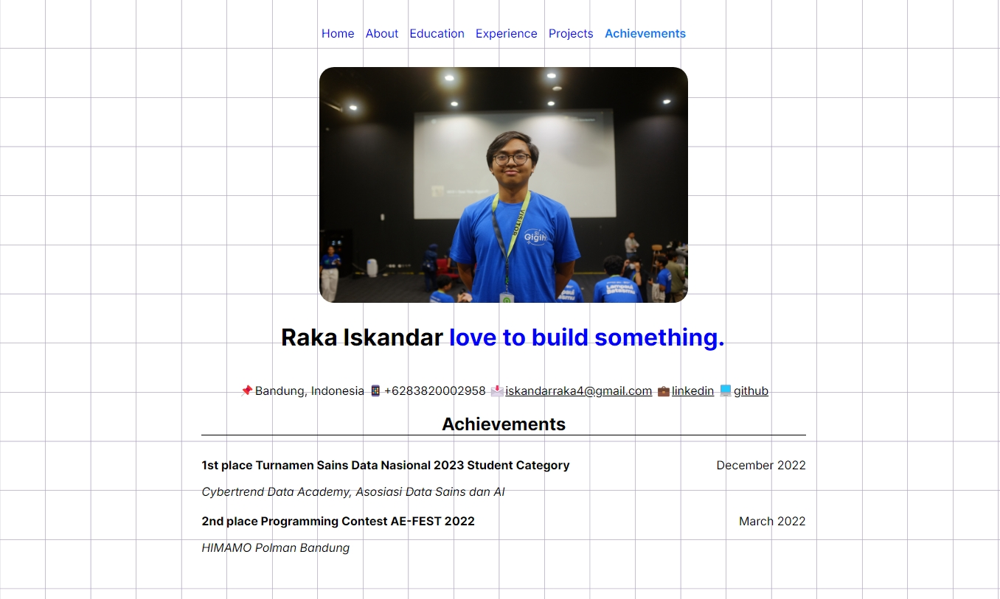

# Portfolio with Django
Ini adalah portfolio yang dibuat dengan framework Django untuk memenuhi tugas mata kuliah pemrograman internet.

## Instalasi Django
**PASTIKAN KAMU SUDAH INSTALL PYTHON!!!!**

Pertama - tama, buat folder project kamu
```bash
mkdir project-kamu
cd project-kamu
```
Setelah itu, install virtual environment package untuk membungkus semua library yang mungkin saja dipakai untuk project django
```bash
pip install virtualenv
```
Lalu, buat virtual environment di folder project kamu
```bash
virtualenv venv
```
Aktifkan virtual environment di folder kamu\
untuk Linux/macOS:
```bash
source venv/bin/activate
```
untuk Windows:
```bash
venv\Scripts\activate
```
Setelah mengaktifkan virtual environment, install Django
```bash 
pip install django
```
Setelah menginstall Django, kamu dapat memulai project Django di folder kamu
```bash
django-admin startproject project-kamu .
```
Sekarang kamu dapat menjalankan project Django dengan cara:
```bash
python manage.py runserver
```

## Hasil






## Dibuat Oleh
Nama: Raka Iskandar\
NIM: 2306068\
Prodi: Pendidikan Ilmu Komputer 3B\
&copy;2024.


